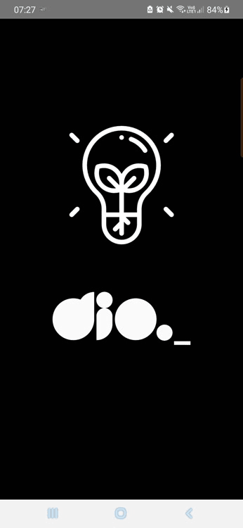

# flashlight

<h1 align="center">
  Flashlight
 
</h1>

Um aplicativo simples que liga a lanterna ao clicar no botão imagem ou chacoalhar o celular.

  

[//]: # (Add your gifs/images here:)

  

## Tecnologias

[//]: # (Add the features of your project here:)

Nessa aplicação foram utilizados as seguintes tecnologias abaixo:

- **React Native** — Uma biblioteca javascript para construção de aplicações
  mobile.
- **Javascript** — Uma linguagem de programação.
- **Typescript** — Um super set para o javascript que auxilia na codificação.

## Iniciando

Primeiro faça o clone do repositório:   `git clone https://github.com/gunners-pro/flashlight` 

Logo após baixe as dependências:   `yarn install` ou `npm install`
   Agora inicie o projeto:  
`yarn start` ou `npm run start`  e então `yarn android` ou `npm run android`.  
Para testar use um dispositivo fisico
conectado ao computador ou um emulador.  
